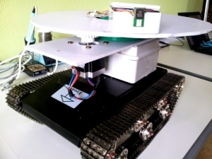

# robotic system to follow dynamic paths

Use of Ultra-Wide-Band radio module to detect the movement of a person in order to follow him in case of acceptable range distance.

### Features
The robot is capable to calculate the distance (max 50m) between the point (person) and itself.
Detects the polar coordinates mixing particle filter and statistics correlation matrix and triangulation.
Control the system in order that the robot always follows the human.

The sensors UWB, ST and Arduino board are programmed in C (controlled by SPI) mixed with C++ follow-path algorithm.
